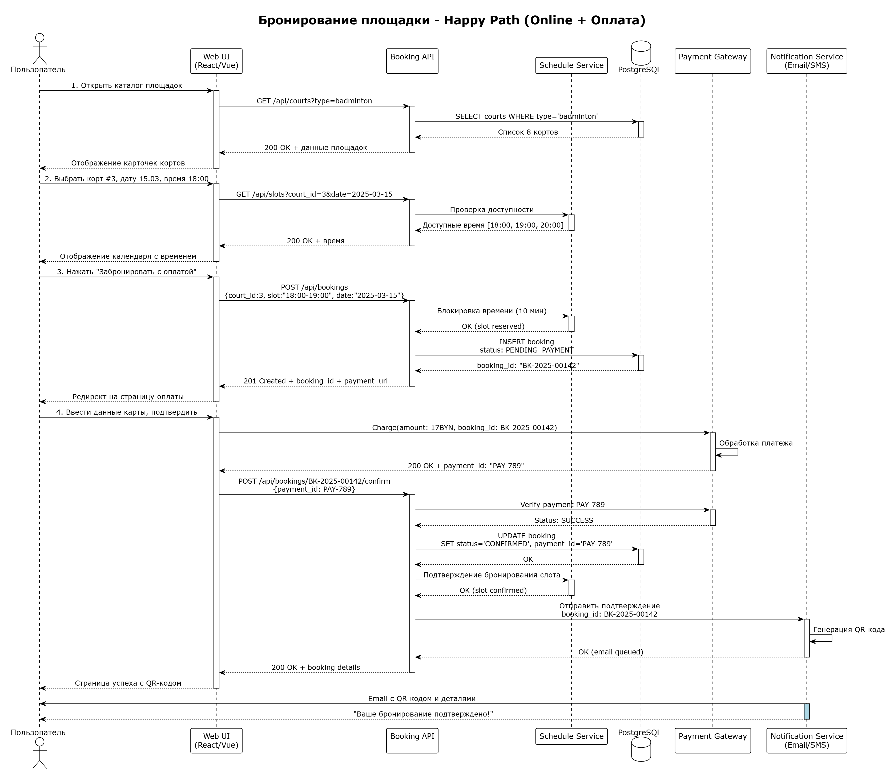
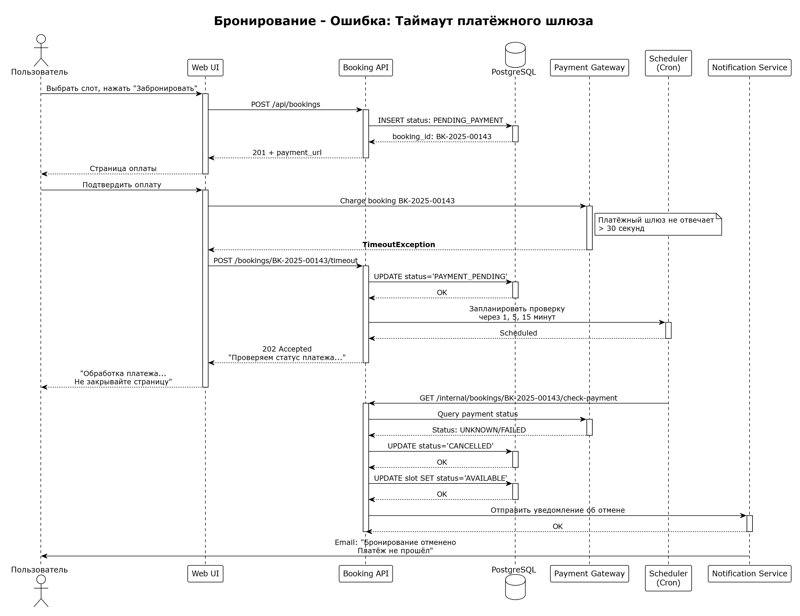

<p align="center">Министерство образования Республики Беларусь</p>
<p align="center">Учреждение образования</p>
<p align="center">"Брестский Государственный технический университет"</p>
<p align="center">Кафедра ИИТ</p>
<br><br><br><br><br><br>
<p align="center"><strong>Лабораторная работа №1</strong></p>
<p align="center"><strong>По дисциплине:</strong> "Проектирование интернет-систем"</p>
<p align="center"><strong>Тема:</strong> "Сценарий транзакции: моделирование use-case и границ ответственности"</p>
<br><br><br><br><br><br>
<p align="right"><strong>Выполнил:</strong></p>
<p align="right">Студент 3 курса</p>
<p align="right">Группы ПО-13</p>
<p align="right">Куликовская А. В.</p>
<p align="right"><strong>Проверил:</strong></p>
<p align="right">Шорох Д.В.</p>
<br><br><br><br><br>
<p align="center"><strong>Брест 2026</strong></p>

---

## Цель работы

Научиться анализировать бизнес-процессы интернет-системы, выявлять границы ответственности компонентов и моделировать транзакционные сценарии с учётом возможных сбоев.

---

## Вариант №51 - Бронь манежа "Свободна площадка?" 🏸🏀🏐🏓

**Питч:** забронируй нужную площадку для игры.

**Ядро домена:** Площадки, Расписание, Брони, Отмены

---

## Ход выполнения работы

### 1. Структура проекта

```
lab-01/
├── README.md               # Основной отчёт (этот документ)
├── use-case.md             # Текстовое описание use-case
├── diagrams/
│   ├── sequence-happy.puml # PlantUML для успешного сценария
│   └── sequence-error-payment.puml
├── scenarios.feature       # Gherkin-сценарии
└── analysis.md             # Анализ границ ответственности
```

---

### 2. Use-case описание

👉 **Ссылка на файл:** [use-case.md](https://github.com/skumbriya21/PIS-2026/blob/lab01-po13-kulikovskaya/students/Kulikovskaya_Alina/lab-01/use-case.md)

**Основной сценарий:**  Забронировать площадку на нужное время

**Первичный актор:**  Зарегистрированный пользователь (спортсмен/команда) или Администратор манежа

**Цель:**  Забронировать спортивную площадку/корт/стол на конкретный временной слот (1 час) с возможностью онлайн-оплаты

**Краткое описание основного потока:**
1. Пользователь открывает сайт с каталогом площадок.
2. Система отображает список доступных типов площадок с фото и характеристиками.
3. Пользователь выбирает тип: "Бадминтонный корт".
4. Система показывает календарь доступных дат и временных слотов (1 час).
5. Пользователь выбирает дату: "2025-03-15" и время: "18:00-19:00".
6. Система проверяет доступность выбранного слота. 
7. Система отображает выбранный слот и стоимость.
8. Пользователь нажимает "Забронировать с оплатой" и оплачивает.
9. Пользователь получает SMS-напоминание за 1 час до начала.

**Альтернативные потоки:** 
   - Пользователь хочет забранировать площадку, но не оплачивать.
   - Пользователь не хочет регистрироваться на сайте и звонит администратору для брони.
   - Отмена бронирования пользователем.

**Исключительные ситуации:** 
   - Временной слот уже занят.
   - Таймаут платёжного шлюза.
   - Недостаточно средств на карте.
   - Нарушение бизнес-правила.
 
---

### 3. Диаграммы последовательности (Sequence Diagrams)

#### 3.1. Happy Path (успешный сценарий)

👉 **PlantUML исходник:** [sequence-happy.puml](diagrams/sequence-happy.puml)



**Описание потока:**
- Пользователь видит список площадок в веб интерфейсе.
- Пользователь бронирует площадку.
- Создается бронь.
- Бронь оплачивается и подтверждается.
- Отправляется уведомление по SMS/Email.
- Пользователю показывается успешная бронь.

**Участники:**
- Авторизованый пользователь.
- Ui.
- API.
- NotificationService.
- DataBase.
- PaymentGateway.

#### 3.2. Error Case (сценарий с ошибкой)

👉 **PlantUML исходник:** [sequence-error-payment.puml](diagrams/sequence-error-payment.puml)



**Описание потока:**
- Ошибка: таймаут платежного шлюза (долго грузилась оплата).

---

### 4. Gherkin-сценарии

👉 **Ссылка на файл:** [scenarios.feature](scenarios.feature)

**Реализовано сценариев:** 7

**Список сценариев:**
1. ✅ **Успешный сценарий** (Happy Path)
2. ✅ **Успешный сценарий** Бронирование администратором по телефону
3. ✅ **Успешный сценарий** Бронирование без online-оплаты (оплата на месте)
4. ✅ **Ошибка:** Cлот уже занят другим пользователем
5. ✅ **Ошибка:** Таймаут сервиса оплаты
6. ✅ **Ошибка:** Недостаточно средств на карте
7. ✅ **Ошибка:** слишком позднее бронирование (менее 30 минут до начала)
8. ✅ **Ошибка:**недоступен Schedule Service
9. ✅ **Ошибка:**попытка отмены менее чем за 2 часа до начала

**Пример сценария:**
```gherkin
Feature: Бронирование спортплощадки

  Scenario: Бронирование администратором по телефону
    Given администратор "Иван" авторизован с ролью "ADMIN"
    And баскетбольная площадка свободна на сегодня с 20:00 до 21:00
    
    When Иван открывает панель администратора
    And выбирает баскетбольную площадку, слот 20:00-21:00
    And вводит данные клиента: ФИО "Петров Петр", телефон "+375291234567"
    And нажимает "Создать бронирование"
    
    Then система создаёт бронирование со статусом "CONFIRMED"
    And клиент получает SMS с подтверждением
    And бронирование не требует online-оплаты
```

---

### 5. Анализ границ ответственности

👉 **Ссылка на файл:** [analysis.md](analysis.md)

#### 5.1. Транзакционные границы

| Операция | Тип | Откат при ошибке | Retry-стратегия | Идемпотентность |
|----------|-----|------------------|-----------------|-----------------|
| **Блокировка слота** | Синхронная | Да (release lock) | Нет (TTL 10 минут) | Да (idempotency_key = booking_id) |
| **Создание бронирования в БД** | Синхронная | Да (DELETE) | Нет (PK constraint) | Да (проверка уникальности user+slot+date) |
| **Вызов Payment Gateway** | Синхронная | Нет (async проверка) | 3 попытки с exponential backoff (1s, 2s, 4s) | Да (payment_intent_id) |
| **Обновление статуса бронирования** | Синхронная | Да (ROLLBACK) | Нет | Да |
| **Отправка email** | **Асинхронная** | Нет (best-effort) | 5 попыток с exp. backoff | Да (deduplication по booking_id) |
| **Освобождение слота при отмене** | Синхронная | Нет | Нет | Да |

#### 5.2. Обработка исключительных ситуаций

**Реализовано стратегий обработки:** 4

**Примеры:**

### 4.1 Race Condition (двойное бронирование)

**Условие:** Два пользователя одновременно бронируют последний слот

**Обнаружение:**
- Schedule Service возвращает ошибку "Slot already locked"
- Или БД возвращает constraint violation при INSERT

**Реакция:**
1. Транзакция второго пользователя откатывается
2. Система предлагает альтернативные слоты
3. Логируется попытка конфликтного доступа

**Компенсация:**
- Не требуется (атомарная проверка в Schedule Service)
- Слот остаётся заблокированным за первым пользователем

**Уведомление:**
- "Извините, этот слот только что заняли. Выберите другое время: 19:00-20:00 или 20:00-21:00"


### 4.2 Нарушение бизнес-правила (минимальное время)

**Условие:** Попытка бронирования &lt; 30 минут до начала слота

**Обнаружение:**
- Валидация на уровне Application Layer: `if (slot_start - now) &lt; 30min`

**Реакция:**
1. Отклонить запрос до создания бронирования
2. Предложить позвонить администратору

**Компенсация:**
- Не требуется (бронирование не создавалось)

**Уведомление:**
- "Слишком поздно для online-бронирования. Звоните: +375 (17) 123-45-67"

---

## Таблица критериев оценки

| Критерий | Баллы | Выполнено |
|----------|-------|-----------|
| Use-case описание (полнота: акторы, предусловия, основной поток, альтернативы, исключения) | 15 | ✅ |
| Sequence diagram (happy path) - корректность нотации UML, включение всех ключевых компонентов | 20 |  ✅ |
| Sequence diagram (error case) - моделирование хотя бы одной исключительной ситуации | 15 |  ✅ |
| Gherkin-сценарии - минимум 4 сценария (1 успешный + 3 ошибочных) | 20 | ✅ |
| Анализ границ ответственности - таблица транзакционных границ, обоснование выбора синхронных/асинхронных операций | 15 |  ✅ |
| Обработка исключений - описание стратегий retry, компенсации, уведомлений | 10 |  ✅ |
| Качество документации - оформление, читаемость, грамотность | 5 |  ✅ |
| **ИТОГО** | **100** | |

---

## Контрольные вопросы

**Подготовка к защите:**

1. Что такое транзакционная граница? Где она проходит в вашем сценарии?
   - Транзакционная граница — это участок процесса, где операции выполняются атомарно и согласованно. 
   - В нашем сценарии она начинается при нажатии пользователем кнопки «Забронировать» и заканчивается фиксацией брони в базе данных и подтверждением оплаты.

2. Почему операция X выбрана синхронной, а Y - асинхронной?
   - Синхронные операции (создание брони, проверка слота, вызов платёжного сервиса) критичны для целостности данных и требуют немедленного результата. 
   - Асинхронные операции (отправка email, уведомления) не влияют на факт брони и могут выполняться позже без нарушения логики.

3. Как обеспечить идемпотентность при повторных запросах?
   - Использовать уникальные идентификаторы операций (idempotency key). 
   - Проверять статус уже выполненной операции перед созданием новой. 
   - При повторном запросе возвращать результат существующей операции вместо дублирования.

4. Что произойдёт, если внешний сервис вернёт ошибку после частичного выполнения операции?
   - Система переводит процесс в промежуточный статус. 
   - Запускается механизм компенсации: откат изменений или отмена операции. 
   - Пользователь получает уведомление о задержке или сбое.

5. Как система обнаружит, что внешний сервис недоступен?
   - По таймауту сетевого запроса или по коду ошибки (например, 503 Service Unavailable). 
   - Событие фиксируется в логах. 
   - Запускается стратегия повторных попыток или постановка задачи в очередь.

6. Какие данные нужно логировать для диагностики сбоев?
   - Уникальный идентификатор операции.  
   - Пользовательский контекст (например, ID пользователя).  
   - Тип операции и её параметры.  
   - Время и причина ошибки (timeout, отказ сервиса).  
   - Количество попыток повторного выполнения и их результат.  
   - Текущий статус операции.

---

## Ссылка на репозиторий

👉 **GitHub:** [репозиторий](https://github.com/skumbriya21/PIS-2026)

---

## Вывод

> В ходе выполнения лабораторной работы был проанализирован бизнес-процесс "Бронь манежа "Свободна площадка?" 🏸🏀🏐🏓". Разработаны use-case диаграммы для основного сценария и альтернативных потоков. Построены sequence diagrams с использованием PlantUML для визуализации взаимодействия компонентов системы. Созданы Gherkin-сценарии для автоматизированного тестирования. Определены транзакционные границы и стратегии обработки ошибок. Освоены навыки моделирования распределённых транзакций и анализа точек отказа в интернет-системах.

---

**Дата выполнения:** 12.03.2026

**Оценка:** _____________

**Подпись преподавателя:** _____________
